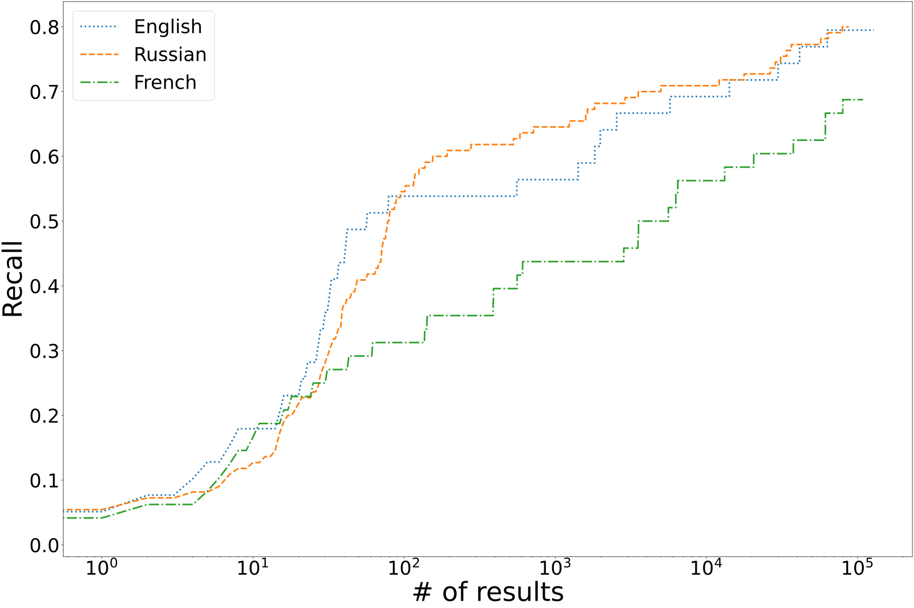

# AcrosticSleuth

AcrosticSleuth is a program for identifying and ranking acrostics. 
At a high level, the tool works by comparing the probability of random occurrence with the probability that a sequence of characters forms a meaningful word or phrase in the target language.
AcrosticSleuth is optimized to quickly process gigabytes of text. 
With the help of AcrosticSleuth, we have been able to discover multiple previously unknown acrostics.
You can read more about the methodology in our upcoming paper ([link to preprint to appear soon]()).

### Table of contents
- [What languages does AcrosticSleuth support?](#what-languages-does-acrosticsleuth-support)
- [Demo](#demo)
- [How to build AcrosticSleuth from source?](#how-to-build-acrosticsleuth-from-source)
- [How was AcrosticSleuth evaluated?](#how-was-acrosticsleuth-evaluated)
- [How to reproduce our results?](#how-to-reproduce-our-results)
- [How to cite this?](#how-to-cite-this)

## What languages does AcrosticSleuth support?
AcrosticSleuth currently support **English, French, Russian, and Latin**. 
The only language-specific component of AcrosticSleuth is the unigram language model produced by [sentencepiece](https://github.com/google/sentencepiece).
Support for new languages can, therefore, be easily added -- please [make an issue](https://github.com/acrostics/acrostic-sleuth/issues/new) here on GitHub if you would like to use AcrosticSleuth with another language. 

## Demo

To run AcrosticSleuth, you need Java 8 or higher installed on your machine (which is likely already the case).

This repository includes a demo dataset comprising a subset of pages with acrostics from the English subdomain of the WikiSource database (see [How was AcrosticSleuth evaluated?](#how-was-acrosticsleuth-evaluated)). 
You can test AcrosticSleuth on this small dataset using:

```bash
java -jar AcrosticSleuth.jar -input data/demo -language EN -charset utf-8 -outputSize 4000 --concise
```

Here is the meaning behind each of the options used:
- `-input data/demo`: analyze all texts in the `data/demo` directory
- `-language EN`: use the default English language model
- `-charset utf-8`: use the utf-8 encoding when opening the files
- `-outputSize 4000`: return top 4000 instances (AcrosticSleuth clusters collocated instances, so the actual number of results it returns is much smaller -- 46)
- `--concise`: only report key information (file,acrostic,rank).

Specifically, you should be getting the following output (highest ranked acrostics appear at the bottom of the list):

```
file    acrostic        rank
data/demo/Flint and Feather (1914)Part 3Canada.txt      canada  1053.8960
data/demo/Flint and Feather (1914)Part 3Brandon.txt     brandon 3092.9519
data/demo/The Canadian soldiers' song book.djvu57.txt   mother  3164.0043
data/demo/Devon and Cornwall Notes and Queries.djvu21.txt       thomas  4477.4781
data/demo/Notes and Queries - Series 12 - Volume 4.djvu257.txt  mary_stokes     13933.539
data/demo/Whole prophecies of Scotland, England, Ireland, France, and Denmark (1).pdf46.txt     sonne_of_god_the        23421.687
data/demo/Through the Looking-Glass, and What Alice Found There.djvu243.txt     alice_pleas_and 65249.310
data/demo/The Elements of LawPart IChapter 1.txt        thomas_of       100742.81
data/demo/Archaeological Journal, Volume 29.djvu98.txt  the_us_parker   205516.31
data/demo/Love's trilogy.djvu79.txt     perhaps 239268.61
data/demo/Life and wonderful prophecies of Donald Cargill (2).pdf24.txt master_donald   550373.21
data/demo/Life and wonderful prophecies of Donald Cargill (1).pdf24.txt master_donald   550373.21
data/demo/Amazing Stories Volume 17 Number 06.djvu6.txt amazing 565896.26
data/demo/Sentimental valentine writer.pdf11.txt        william 1024341.2
data/demo/New mirror of love.pdf24.txt  william 1024341.2
data/demo/Clouds without Water (Crowley, 1909).djvu24.txt       kathleen_bruce  1414519.3
data/demo/Collingwood - Life and Letters of Lewis Carroll.djvu388.txt   agnes_georgina_hull     1857954.0
data/demo/United States Army Field Manual 7-93 Long-Range Surveillance Unit OperationsAppendix F.txt    survival        1914206.3
data/demo/The Confessions of William-Henry Ireland.txt  tail_chaucer_fa_pali_at_chatterton      2949134.8
data/demo/New mirror of love.pdf19.txt  love_you_henry  3346046.1
data/demo/Notes and Queries - Series 2 - Volume 1.djvu216.txt   william_bed_low 3895124.0
data/demo/The Hunting of the Snark (1876).djvu11.txt    gertrude_chat_away      4860150.2
data/demo/Carroll - Rhyme and Reason.djvu11.txt gertrude_chat_away      4860150.2
data/demo/Elegy upon the death of that famous and faithful minister and martyr Mr. James Renwick.pdf11.txt      master_james    8328207.9
data/demo/The Alchemist (Jonson)Argument.txt    the_alchemist   11557749
data/demo/The Works of Ben Jonson - Gifford - Volume 4.djvu13.txt       the_alchemist   11557749
data/demo/Carroll - Three Sunsets.djvu83.txt    prince_charlie  14336506
data/demo/Christian Astrology.txt       william_lilly   22086068
data/demo/Ben King's VerseAsphodel.txt  cornelia_bassett        22318962
data/demo/Notes and Queries - Series 9 - Volume 2.djvu394.txt   charles_franck  37175627
data/demo/Whole prophecies of Scotland, England, Ireland, France &amp; Denmark.pdf46.txt        christ_sonne_of_god_the 86669560
data/demo/Most remarkable passages in the life of the honourable Colonel James Gardiner.pdf24.txt       james_gardiner  1.2227672E+8
data/demo/An Acrostic.txt       elizabeth       3.2799235E+8
data/demo/Complete Works of Lewis Carroll.djvu292.txt   alice_pleasance_liddell 5.0375007E+8
data/demo/Through the looking-glass and what Alice found there (IA throughlookinggl00carr4).pdf323.txt  alice_pleasance_liddell 5.0375007E+8
data/demo/Notes by the Way.djvu61.txt   to_joseph_knight        1.6465724E+9
data/demo/This Canada of ours and other poems.djvu39.txt        as_the_great_divided    1.8429494E+10
data/demo/The complete poetical works and letters of John Keats, 1899.djvu279.txt       georgiana_augusta_keats 4.0955944E+10
data/demo/Good news to Scotland (1).pdf2.txt    master_richard_cameron  1.6211098E+11
data/demo/Good news to Scotland (2).pdf2.txt    master_richard_cameron  1.6211098E+11
data/demo/St. Nicholas - Volume 41, Part 1.djvu59.txt   thanksgiving    4.1471177E+11
data/demo/Elizabeth (Poe).txt   elizabeth_rebecca       1.6337993E+12
data/demo/The Old GuardVolume 1Issue 1Acrostic.txt      george_washington       3.5446523E+12
data/demo/The Confessions of William-Henry Ireland.txt  warwick_at_dudley_at_southampton_at_rivers_at_shakspeare        7.6181055E+27
```

## How to build AcrosticSleuth from source?

To build AcrosticSleuth, you need Java SDK installed on your machine.
We have tested AcrosticSleuth on Mac, Mac-Arm, Ubuntu, and Windows [as part of our CI](.github/workflows/main.yml).

The following two commands should build the jar file for you:

```bash
javac -encoding UTF-8 -d out -cp src src/acrosticsleuth/*.java 
jar cfe AcrosticSleuth.jar acrosticsleuth.Main -C out . -C models .
```


## How was AcrosticSleuth evaluated?

We have created the [Acrostic Identification Dataset](https://github.com/acrostics/acrostic-identification-dataset) (AcrostID) by manually identifying all poems explicitly referred to or formatted as acrostics on English, Russian, and French subdomains of [WikiSource](https://en.wikisource.org/wiki/Main_Page), an online library of source texts in the public domain.
AcrosticSleuth reaches recall of over 50% within the first 100 results it returns for English and Russian, and recall rises to up to 80% when considering more results.
Read more in our paper ([link to preprint to appear soon]()):



## How to reproduce our results?

This section describes the steps for reproducing results we report in the accompanying paper ([link to preprint to appear soon]()), 
in particular for producing the graph we show above.
Note that you might need over 60 GB of free disk space, a fast internet connection, and, depending on your machine, up to several hours to fully download the dataset and reproduce the results.
As a faster verification alternative, we strongly recommend that you try out our [Hello World Example](#hello-world-example).

Please use a Mac OS or Ubuntu machine to reproduce the results.
While these typically are preinstalled on Linux and Mac OS machines, you will need `curl`, `bzip2`, and `python3` throughout this process.
Your python environment must also have `pylcs`, `numpy`, and `matplotlib` installed (`pip3 install pylcs numpy matplotlib`)

First, clone this directory with the `--recursive` flag, so that it also includes the necessary submodules.
Next, follow the directions for [downloading and setting up the Acrostic Identification Dataset](https://github.com/acrostics/acrostic-identification-dataset/blob/main/README.md), which is cloned as a submodule for this repository in the `data` directory.
Make sure to run the [get_data.sh](https://github.com/acrostics/acrostic-identification-dataset/blob/main/get_data.sh) script as discussed in the README linked above.

Finally, to run AcrosticSleuth on the dataset and measure its recall, run [data/evaluate_on_acrostics-identification-dataset.sh](data/evaluate_on_acrostics-identification-dataset.sh). 
The script will save the output files in the `output` directory and produce `RecallFigure.png` figure that plots the recall graph you see above and in the paper. 

## How to cite this?

Fedchin, A., Cooperman, I., Chaudhuri, P., Dexter, J.P. 2024 "AcrosticSleuth: Probabilistic Differentiation and Ranking of True Acrostics in Multilingual Corpora". Forthcoming
